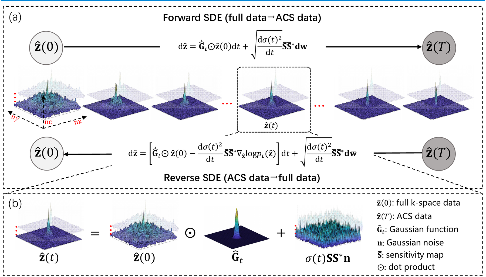

# Physics-Informed DeepMRI: k-Space Interpolation Meets Heat Diffusion

This repository contains the official PyTorch implementation of:

> **Physics-Informed DeepMRI: k-Space Interpolation Meets Heat Diffusion**
> [Zhuo-Xu Cui](https://zhuoxucui.github.io/)<sup>\*</sup>, [Congcong Liu](https://sober235.github.io/)<sup>\*</sup>, Xiaohong Fan, Chentao Cao, Jing Cheng, Qingyong Zhu, Yuanyuan Liu, Sen Jia, Haifeng Wang, Yanjie Zhu, Yihang Zhou, Jianping Zhang, Qiegen Liu, Dong Liang.
> *IEEE Transactions on Medical Imaging*, vol. 43, no. 10, pp. 3503–3520, 2024.
> [[IEEE Xplore]](https://ieeexplore.ieee.org/document/10683732/) &nbsp;&nbsp; [[arXiv:2308.15918]](https://arxiv.org/abs/2308.15918) &nbsp;&nbsp; [[DOI:10.1109/TMI.2024.3462988]](https://doi.org/10.1109/TMI.2024.3462988) &nbsp;&nbsp; [[Papers with Code]](https://paperswithcode.com/paper/physics-informed-deepmri-bridging-the-gap)
>
> <sup>\*</sup> Equal contribution (co-first authors).

This is the maintained release at the MAiTL-Group. The original first-author release is available at [`ZhuoxuCui/Heat-Diffusion`](https://github.com/ZhuoxuCui/Heat-Diffusion).

---

## Illustration



*Overall framework diagram.* **(a)** In the forward process, fully sampled k-space data undergoes heat diffusion towards low-frequency ACS data while noise conforming to the coil-sensitivity distribution is gradually incorporated; in the reverse process, high-frequency information is reconstructed from the noised low-frequency ACS data. **(b)** The k-space data is decomposed into a low-frequency ACS component multiplied by a Gaussian function, plus a Gaussian noise term modulated by the coil-sensitivity map.

## Overview

We model the attenuation of high-frequency information in k-space as a forward **heat diffusion** process, and formulate accelerated MRI reconstruction as the corresponding **reverse heat diffusion**. To make the reverse process tractable, we modify the heat equation to be consistent with magnetic-resonance **parallel-imaging physics**, and solve it with a **score-based generative model**. Experiments on public datasets show improvements over both traditional and deep-learning k-space interpolation methods, especially in high-frequency regions.

## Dependencies

Tested on Ubuntu 22.04.5 LTS with CUDA 12.6 and PyTorch 2.6.

Main packages:

* `torch`, `torchvision`, `torchaudio`
* `numpy`, `scipy`, `h5py`, `mat73`, `dill`
* `sigpy`, `pytorch-wavelets`, `PyWavelets`, `opencv-python`
* `tensorboard`, `tqdm`, `PyYAML`, `icecream`, `matplotlib`, `pillow`
* `cupy-cuda12x` (for ESPIRiT calibration via SigPy)

A pinned list is provided in `requirements.txt`:

```bash
pip install -r requirements.txt
```

## Project Structure

```
HD_code/
├── main.py                  # Entry point (train / sample)
├── configs/
│   └── fastMRI.yml          # Configuration (data, model, diffusion, training, sampling, optim)
├── runners/
│   └── diffusion.py         # Train / sample loops
├── models/
│   ├── diffusion.py         # U-Net backbone with sinusoidal time embedding
│   └── ema.py               # EMA weight averaging
├── functions/
│   ├── denoising.py         # Reverse-diffusion samplers (Heat / DDPM variants)
│   ├── losses.py            # Score-matching / noise-estimation losses
│   └── ckpt_util.py
├── datasets/
│   └── __init__.py          # FastMRIv2 dataset wrapper
├── utils.py, utils2.py      # MRI operators (FFT, SENSE, SPIRiT, ESPIRiT, CG, masks)
├── AdaptiveCombine.py       # Multi-coil adaptive combination
├── cg.py
├── optimal_thresh.py
├── train.sh / test.sh       # Convenience launchers
├── LICENSE                  # MIT
└── requirements.txt
```

`main.py` is the common gateway. Run `python main.py --help` for the full CLI. The config file path is relative to `configs/`, so `--config=fastMRI.yml` resolves to `configs/fastMRI.yml`.

## Data Preparation

The default pipeline (`config.data.dataset = "fastMRIv2"`) expects multi-coil k-space samples stored as `.mat` files. Set the two dataset paths in `configs/fastMRI.yml`:

```yaml
data:
    train_kspace_dir: "/path/to/your/training/data"
    sample_kspace_dir: "/path/to/your/test/data"
```

* Training files should contain an image volume keyed `img`.
* Sampling files should contain a k-space volume keyed `ksp`.

Files may live in nested subdirectories — the dataset walks `*.mat` recursively.

## Training

```bash
sh train.sh
# or equivalently:
python main.py --config=fastMRI.yml --exp=./exp --doc=heat
```

Outputs:

* Checkpoints: `./exp/logs/heat/<timestamp>/ckpt_<step>.pth`
* TensorBoard: `./exp/tensorboard/heat/`

Snapshots are written every `training.snapshot_freq` steps (default 1000).

## Sampling

1. Set the checkpoint directory in `configs/fastMRI.yml`:

   ```yaml
   sampling:
       weight: "./exp/logs/heat/<timestamp>"
       ckpt_id: 671000
   ```

2. Run:

   ```bash
   sh test.sh
   # or equivalently:
   python main.py --config=fastMRI.yml --exp=./exp --doc=heat \
                  --sample --fid --timesteps=50 --eta=1 --image_folder=results
   ```

Reconstructions are saved as `.mat` files under `./exp/image_samples/results/`, preserving the directory structure relative to `data.sample_kspace_dir`. Each output contains:

* `cg_sense` — CG-SENSE zero-filled baseline (warm start)
* `label` — fully-sampled reference (from the inverse FFT of `ksp`)
* `diff` — reconstruction from the reverse heat diffusion

## Pretrained Checkpoints

Pretrained weights will be released here. *(TODO: add download link)*

## Citation

If you find this work useful, please cite:

```bibtex
@article{cui2024physics,
  title   = {Physics-Informed {DeepMRI}: k-Space Interpolation Meets Heat Diffusion},
  author  = {Cui, Zhuo-Xu and Liu, Congcong and Fan, Xiaohong and Cao, Chentao and
             Cheng, Jing and Zhu, Qingyong and Liu, Yuanyuan and Jia, Sen and
             Wang, Haifeng and Zhu, Yanjie and Zhou, Yihang and Zhang, Jianping and
             Liu, Qiegen and Liang, Dong},
  journal = {IEEE Transactions on Medical Imaging},
  volume  = {43},
  number  = {10},
  pages   = {3503--3520},
  year    = {2024},
  doi     = {10.1109/TMI.2024.3462988}
}
```

*Authors marked with* <sup>\*</sup> *contributed equally as co-first authors.*

## License

Released under the [MIT License](LICENSE). Copyright (c) 2024 MAiTL-Group, SIAT, CAS.

## Acknowledgments

Parts of the codebase are derived from the official DDPM and NCSN PyTorch implementations.

## Known Issues

The following pre-existing issues are tracked but not addressed in this release; PRs welcome.

* `utils.py` and `utils2.py` contain duplicated MRI operator definitions.
* `functions/denoising.py` defines the `Aclass` data-consistency helper twice.
* `runners/diffusion.py` includes a stale `from curses import KEY_ENTER` import.
* `datasets/celeba.py`, `datasets/ffhq.py`, `datasets/lsun.py` are unused by the FastMRI pipeline.
* `runners/diffusion.py` truncates the sampling schedule to the first 50 steps internally, which can override the value passed via `--timesteps`.
* `runners/diffusion.py` overwrites `config.sampling.mask_type` at runtime; the value in `configs/fastMRI.yml` is currently ignored.
